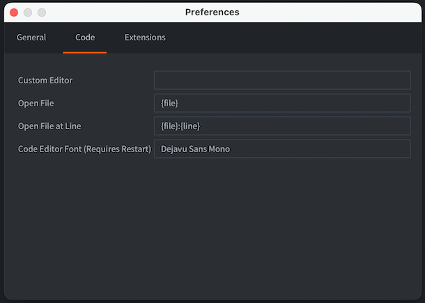
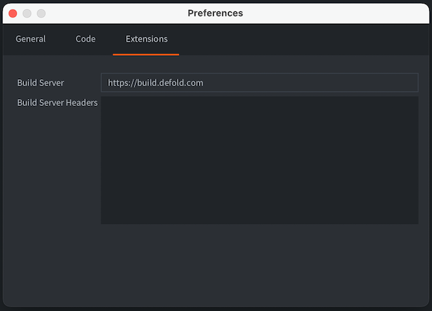

# Editor preferences

You can modify the settings of the editor from the Preferences window. The preferences window is opened from the <kbd>File -> Preferences</kbd> menu.

## General

{srcset="images/editor/preferences_general@2x.png 2x"}

Load External Changes on App Focus
: Enables scanning for external changes when the editor receives focus.

Open Bundle Target Folder
: Enables opening of the target bundle folder after bundling process is done.

Enable Texture Compression
: Enables [texture compression](/manuals/texture-profiles) for all builds made from the editor.

Escape Quits Game
: Shutdown a running build of your game using the <kbd>Esc</kbd> key.

Track Active Tab in Asset Browser
: The file edited in selected tab in the *Editor* pane will be selected in the Asset Browser (also known as the *Asset* pane).

Path to custom keymap
: Absolute path to a file containing [custom keyboard shortcuts](/manuals/editor-keyboard-shortcuts).

## Code

{srcset="images/editor/preferences_code@2x.png 2x"}

Custom Editor
: Absolute path to an external editor. On macOS it should be the path to the executable inside the .app (eg `/Applications/Atom.app/Contents/MacOS/Atom`).

Open File
: The pattern used by the custom editor to specify which file to open. The pattern `{file}` will be replaced by the filename to open.

Open File at Line
: The pattern used by the custom editor to specify which file to open and on which line number. The pattern `{file}` will be replaced by the filename to open and `{line}` by the line number.

Code editor font
: Name of a system installed font to use in the code editor.
◊

## Extensions

{srcset="images/editor/preferences_extensions@2x.png 2x"}

Build Server
: URL to the build server used when building a project containing [native extensions](/manuals/extensions). It is possible to add a username and access token to the URL for authenticated access to the build server. Use the following notation to specify the username and access token: `username:token@build.defold.com`. Authenticated access is required for Nintendo Switch builds and when running your own build server instance with authentication enabled ([refer to the build server documentation](https://github.com/defold/extender/blob/dev/README_SECURITY.md) for more information). The username and password can also be set as the system environment variables `DM_EXTENDER_USERNAME` and `DM_EXTENDER_PASSWORD`.

Build Server Headers
: additional headers to the build server when building native extensions. It's important for using CloudFlare service or similar services with extender.

## Tools

{srcset="images/editor/preferences_tools@2x.png 2x"}

ADB path
: Path to [ADB](https://developer.android.com/tools/adb) command line tool installed on this system. If you have ADB installed on your system, the Defold editor will use it to install and run bundled Android APKs to a connected Android Device. By default, the editor checks if ADB is installed in well-known locations, so you only need to specify the path if you have ADB installed in a custom location.

ios-deploy path
: Path to [ios-deploy](https://github.com/ios-control/ios-deploy) command line tools installed on this system (only relevant for macOS). Similarly to the ADB path, the Defold editor will use this tool to install and run bundled iOS applications on a connected iPhone. By default, the editor checks if ios-deploy is installed in well-known locations, so you only need to specify the path if you use a custom installation of os-deploy.